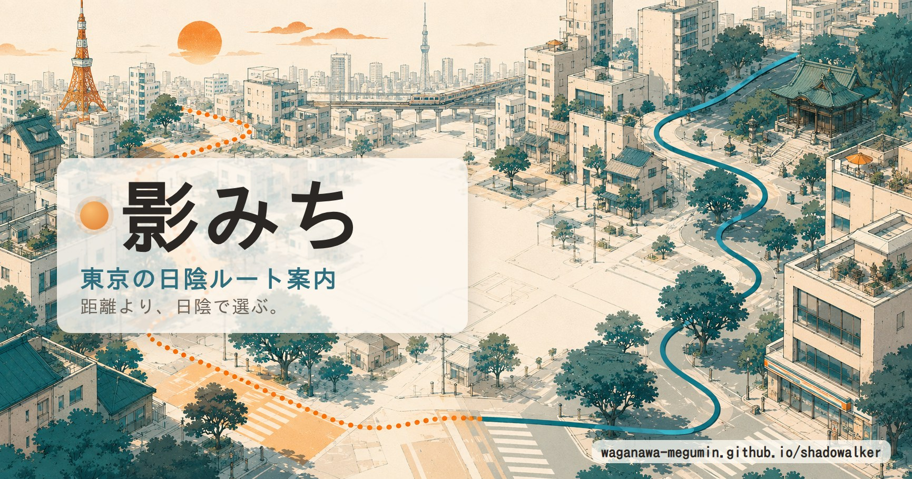
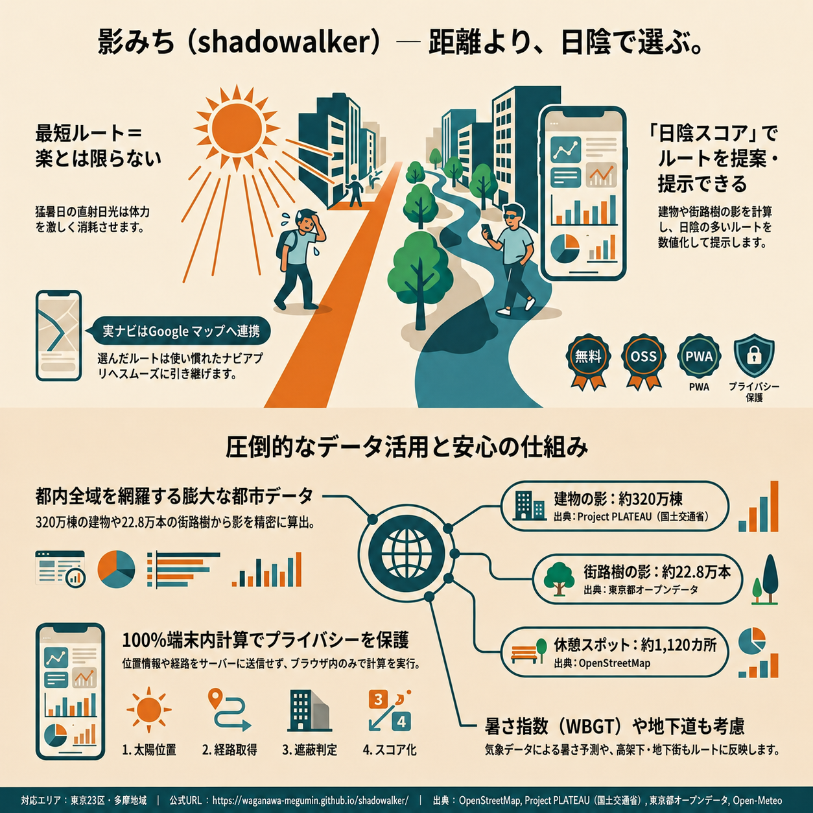

# 影みち（shadowalker）

**距離より、日陰で選ぶ。** — 東京の暑い日に、距離だけでなく **日陰の多さ＝体感の楽さ** で
徒歩ルートを比較・推薦するモバイルWebアプリ（PWA）です（表示名＝**影みち** / 識別子＝**shadowalker**）。

[](https://waganawa-megumin.github.io/shadowalker/)

▶ **アプリ（動作確認用）**: <https://waganawa-megumin.github.io/shadowalker/>
（スマホのブラウザでそのまま動きます。ホーム画面に追加すれば PWA として起動。）



**対応エリア：東京都（23区＋多摩）**（建物=PLATEAU 約320万棟、街路樹=東京都オープンデータ 約22.8万本を収録）。
島嶼部や都外でも OpenStreetMap データで概算します。**計算はすべて端末内（ブラウザ）**で行い、位置・経路をサーバへ送信しません。

> 「距離だけが楽さじゃない」を可視化するツール。道案内そのものは Google マップが得意なので、
> 影みちは**日陰で選ぶ**ところに専念し、各ルートの「**Googleマップで開く**」ボタンから実ナビへ渡します。

## ひと目でわかる（インフォグラフィック）



## 使い方

1. 出発地・目的地を **地図タップ / 地名検索 / 現在地ボタン** で指定
2. 「いつ歩く？」で日付・時刻を選ぶ（太陽の位置が更新されます）
3. 「近さ ⟷ 日陰の多さ」スライダーで重視するバランスを調整
4. **影みちを探す** で複数の徒歩ルートを日陰率で比較しておすすめを表示
   - 日陰＝ティール / 日なた＝オレンジ / 覆い経路（地下・アーケード）＝濃ティール破線
   - ルートカードに「うち覆い経路◯%」、暑い日（WBGT高め）は日陰率に応じて「日陰★〜★★★」
   - パネルのトグルで **休憩スポット（給水・トイレ）** を地図に表示（ズーム16以上）
5. 気に入ったルートの「**このルートをGoogleマップで開く**」で歩行ナビへ

## 仕組み

- **太陽位置**: 緯度経度と日時からの天文計算（SunCalc準拠・外部データ不要）
- **日陰判定**: 各地点から太陽方向へレイを飛ばし、遮る高さの **建物・街路樹** があるかを判定。
  **アーケード・地下街・高架下**などの覆い経路は「常時日陰の辺」として重畳。判定は
  **一様グリッド＋R-tree** で高速化し、負荷が高い時は **Web Worker** に逃がします。
- **徒歩ルート**: BRouter(foot) を優先、OSRM-foot(FOSSGIS) → Valhalla → OSRM-car にフォールバック
- **建物高さ**: PLATEAU（国交省）**東京都 約320万棟（23区＋多摩）**を優先マージ、都外/島嶼部は OpenStreetMap、欠損は約9m
- **街路樹**: 東京都オープンデータ「都道の街路樹」**約22.8万本（区部＋多摩）**＋ OSM `natural=tree`
- **公園・緑地**: OSM の公園ポリゴン **約1.2万**（内部を緑陰の涼域＝日陰相当0.5として加点）
- **休憩スポット**: OSM の給水・トイレ **約1,120点**（地図トグルでピン表示・ルート評価には不影響）
- **暑さ指数(WBGT)**: Open-Meteo の気温・湿度・日射・風から近似（区分表示＋日陰★の発火に連動）
- **地名検索 / 天気**: Nominatim（debounce・中断・キャッシュ）/ Open-Meteo

外部サービスはすべてキー不要。Overpass等の結果は **IndexedDB に bbox 単位でキャッシュ**（TTL7日）。
出典・ライセンスは [`LICENSE_DATA.md`](./LICENSE_DATA.md)。

## 開発

```bash
npm install
npm run dev        # http://localhost:5173/
npm run test       # Vitest（純粋ロジックの単体テスト）
npm run typecheck  # tsc --noEmit
npm run build      # 型チェック + dist 生成
npm run preview    # dist をプレビュー
```

- ネットワーク無し（CI/サンドボックス等）でも UI 確認できるよう、`?stub=1` で外部呼出を
  `public/data/sample/*` のダミーへ固定します（開発時は fetch 失敗時に自動フォールバック）。
- 現在地（Geolocation）は HTTPS か localhost でのみ動作します。

### 実データの投入（手動・任意）

いずれも **0.01°グリッドのタイル**（`public/data/{plateau,trees}/{index.json, t/*.json}`）を生成し、
実行時はルート周辺のタイルだけを読み込みます（広域でも軽量）。抽出は逐次書き出しで低メモリです。

```bash
# 建物: Flateau の gpkg を building_lod0 レイヤ指定で GeoJSON 化 → 複数区まとめて投入
ogr2ogr -f GeoJSON -t_srs EPSG:4326 13104.geojson 13104_*.gpkg building_lod0
npm run extract:plateau -- 13104.geojson [13103.geojson ...]   # 23区分まとめて可
# 街路樹: 東京都「都道の街路樹」CSV（区部・多摩など複数可。CP932/UTF-8自動判定）
npm run extract:trees -- tokyo_gairoju.csv [tokyo_tama_gairoju.csv ...]
# 公園・緑地: OSM等のポリゴンGeoJSON（複数可）→ public/data/parks/parks.json
npm run extract:parks -- parks*.geojson
# 休憩スポット: OSMの給水/トイレ点GeoJSON（複数可）→ public/data/poi/poi.json
npm run extract:poi -- poi*.geojson
```

公園・休憩スポットは OSM(Overpass) から取得します。`leisure=park|garden|recreation_ground` /
`amenity=drinking_water|toilets` を東京bboxで分割取得（タイムアウト回避）→ `osmtogeojson` で
GeoJSON化 → 上記スクリプトで統合します（公園は単一 `parks.json`、給水/トイレは `poi.json`）。

23区全域の Flateau 一括取得は Source Cooperative の S3 互換プロキシから（認証不要）:
`aws s3 sync s3://pacificspatial/flateau/gpkg/ ./gpkg --endpoint-url https://data.source.coop --no-sign-request --region us-west-2 --exclude "*" --include "131*"`

各データの取得先は `LICENSE_DATA.md` と各スクリプト冒頭のコメントを参照。これらは CI には載せず手動運用です。

## デプロイ（GitHub Pages）

`.github/workflows/deploy.yml` が `main` / 開発ブランチへの push で `npm ci && npm run build` し、
`dist/` を Pages へ配信します。初回のみ **Settings → Pages → Source = GitHub Actions** に設定してください。
サブパス（`/shadowalker/`）対応のため Vite の `base: './'` と相対パスを使用しています。

## 構成

```
index.html                 Vite エントリ（<title>影みち / OG・favicon）
src/
  main.ts                  配線・状態管理・SW登録（自動更新）
  config.ts  types.ts  geo.ts  weather.ts  geocode.ts
  sun/position.ts          太陽位置
  routing/{provider,brouter,osrm-foot,valhalla,geom}.ts
  shade/{buildings,ray,covered,trees,parks,score,runner,worker}.ts
  data/{overpass,plateau,trees-tokyo,parks,poi,local}.ts   取得＋IndexedDBキャッシュ
  map/{leaflet-setup,render-route,poi-layer}.ts
  ui/{controls,compass}.ts
scripts/{extract-plateau,extract-trees,extract-parks,extract-poi}.ts   手動データ抽出
public/{manifest.webmanifest, sw.js, favicon.svg, og-image.jpg, icons/, data/}
docs/infographic.png       インフォグラフィック
legacy/prototype.html      初期プロトタイプ（無改変保管）
```

## 限界（相対比較の目安として）

歩行者専用路・地下通路・アーケードは経路グラフと覆いデータ次第で完全ではありません。
建物高さは都外/島嶼部では OSM/仮定値、街路樹も都外では OSM に依存します。
高架下・日射の散乱・屋根形状（LOD2）は簡略化しています。実際のナビは Google マップへ委ねる設計です。
